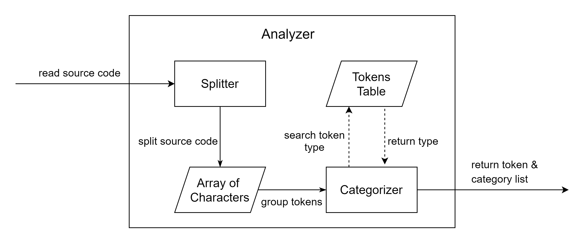
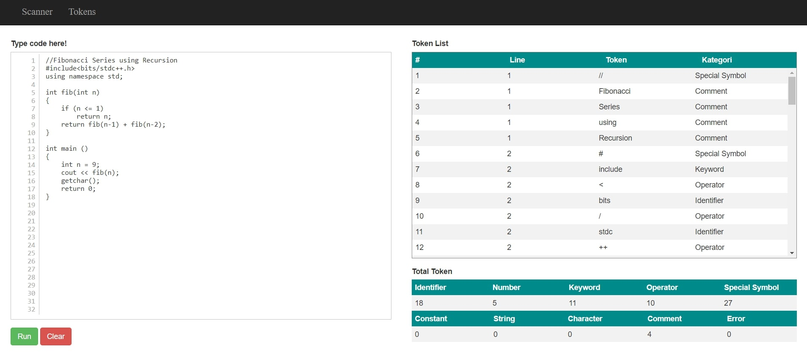

## 
 C++ Analyzer 

 

#### Description
A lexical analyzer or scanner website application. The website read C++ source as an input, group it into tokens, and analyze the category or type of tokens.

#### Features
* Recognize standard token categories in C++ including numbers, strings, characters, constants, comments, identifiers, keywords, operators, and special symbols
* Can split the source code into the smallest possible token up to 1 character
* Displayed the tokens in order and by line
* Ignore whitespace and blank space
* Can count the total tokens for each type and overall

#### Technologies
* PHP
* HTML
* JS
* CSS
* Bootstrap
* JQuery

#### System Diagram
***

#### Screenshoots
***

