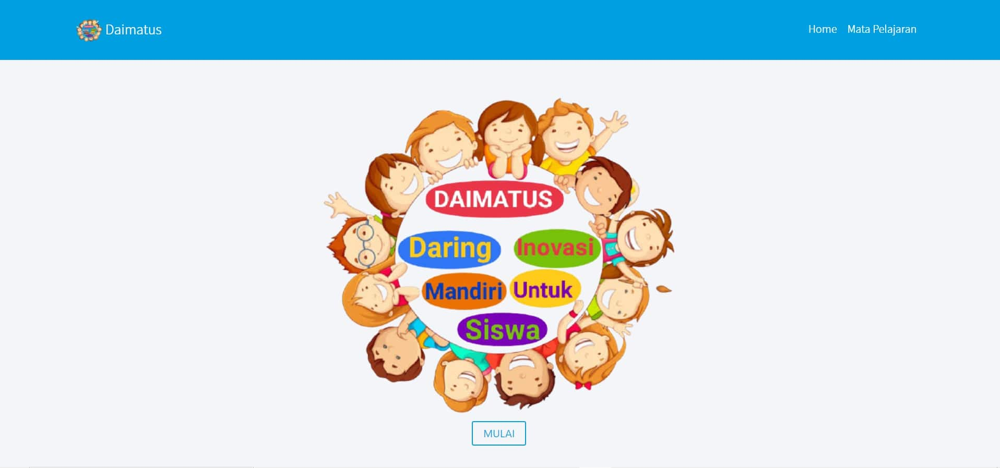
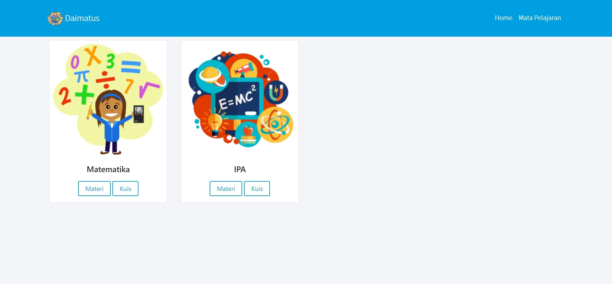
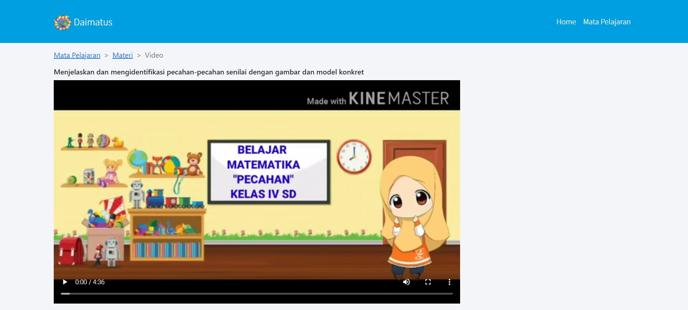
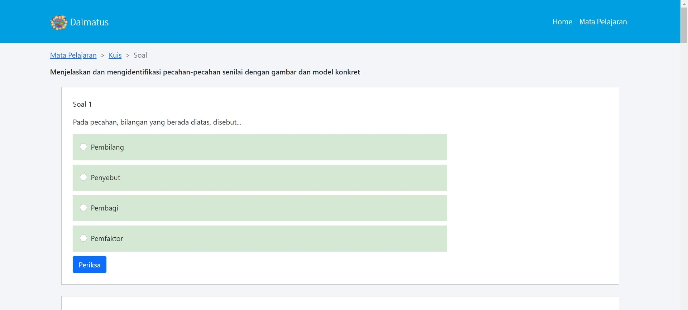
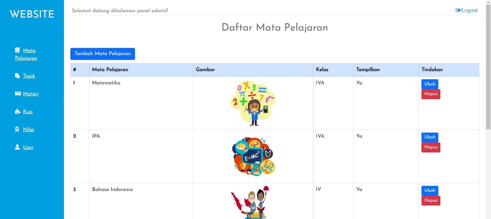
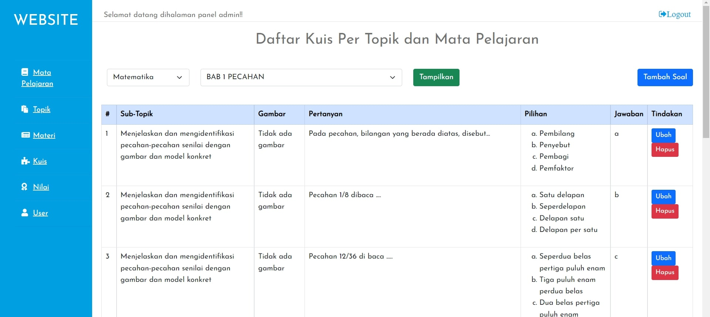

## 
 Daimatus 

 

#### Description
This is a fullstack web used as online learning platform for fourth grade student. This web has client side for student to watch learning materials and do quiz. The admin web for teacher used for customize learning materials and quizzes. This web built using php native, html, css, and js.

#### Features
Client site :
* Watch video materials
* Do quiz and submit it

Admin site :
* Customizing materials including topic, sub topic, materials picture, and materials video
* Customizing quizzes per materials
* Configure admin user

#### Technologies
* PHP
* HTML
* CSS
* JS
* MySQL
* Font Awesome
* Bootstrap
* JQuery
* SweetAlert

#### Screenshoots
***

***

***

***

***

***

