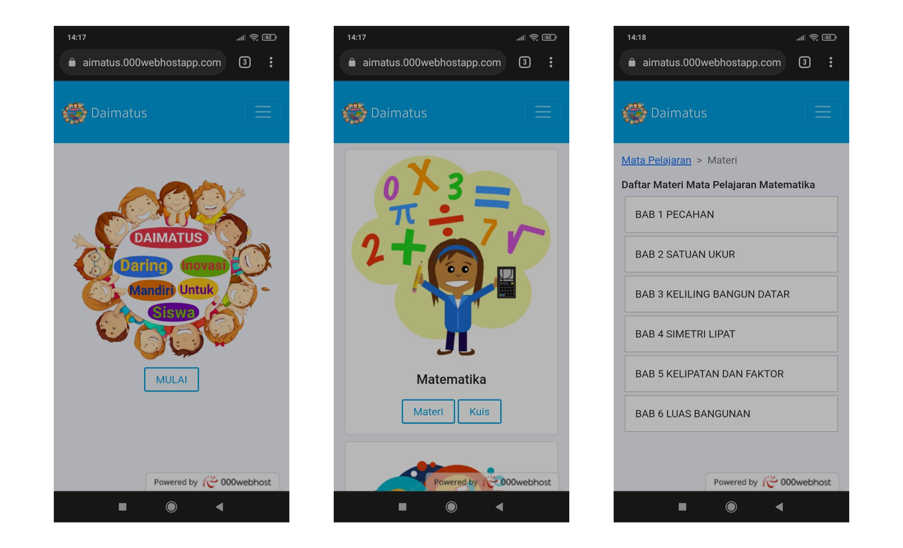
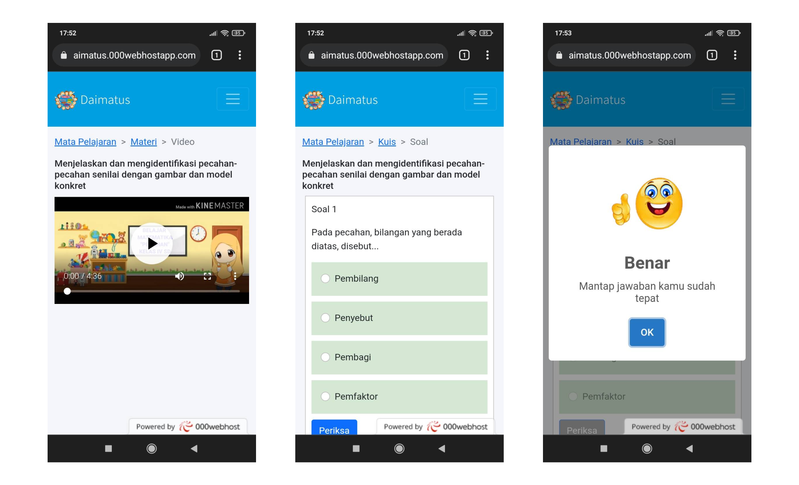

## 
 Daimatus 

 

#### Description
A full-stack web used as an online learning platform for fourth-grade students. This web has a client and admin site. The student can watch learning materials and do the quiz. The teacher used the admin site to upload, update, and delete learning materials and quizzes.

#### Features
Client site :
* List of all subjects
* Every subject have a list of topic material
* Students can watch video material on a topic
* Students can do a quiz on a topic, submit the quiz, and get the grade
* can display cute emoticon and play audio for a correct or wrong answer on quiz

Admin site :
* can log in to an existing admin account, create a new account, or update the account
* Ability to upload, update, and delete subject, topic, subtopic, and logo of a subject
* Ability to upload, update, and delete video materials
* Ability to upload, update, and delete quiz material
* monitor students quizzes grade
* can display or hide a subject

#### Technologies
* PHP
* HTML
* CSS
* JS
* MySQL
* Font Awesome
* Bootstrap
* JQuery
* SweetAlert

#### Screenshoots
***

***

***

***

***

***

***

***

