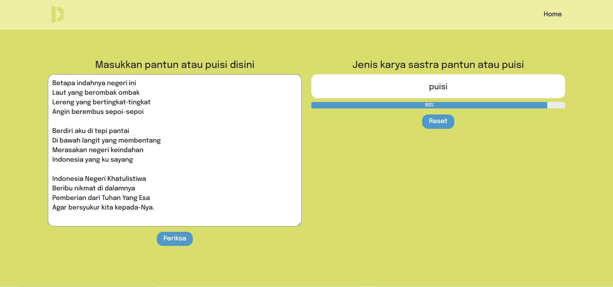

## 
Deteksi Pantun Puisi

 

#### Description
A machine learning web-based application that can detect the type of Indonesian poem between pantun and puisi from a text poem. This project is an implementation of a sentiment analysis technique to determine the type of poem using SVM algorithm.

#### Features
* Classifying if an Indonesian poem is a pantun or puisi
* Get probability of classification

#### Technologies
* Python
* Django
* Bootstrap
* Scikit-learn

#### Screenshoots
***

