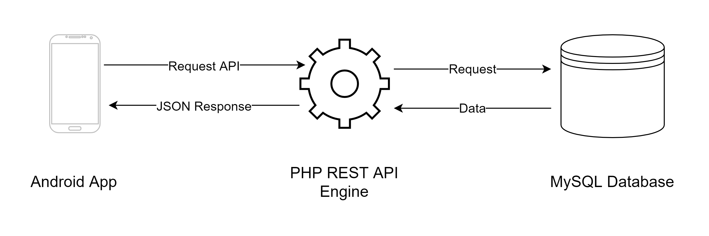
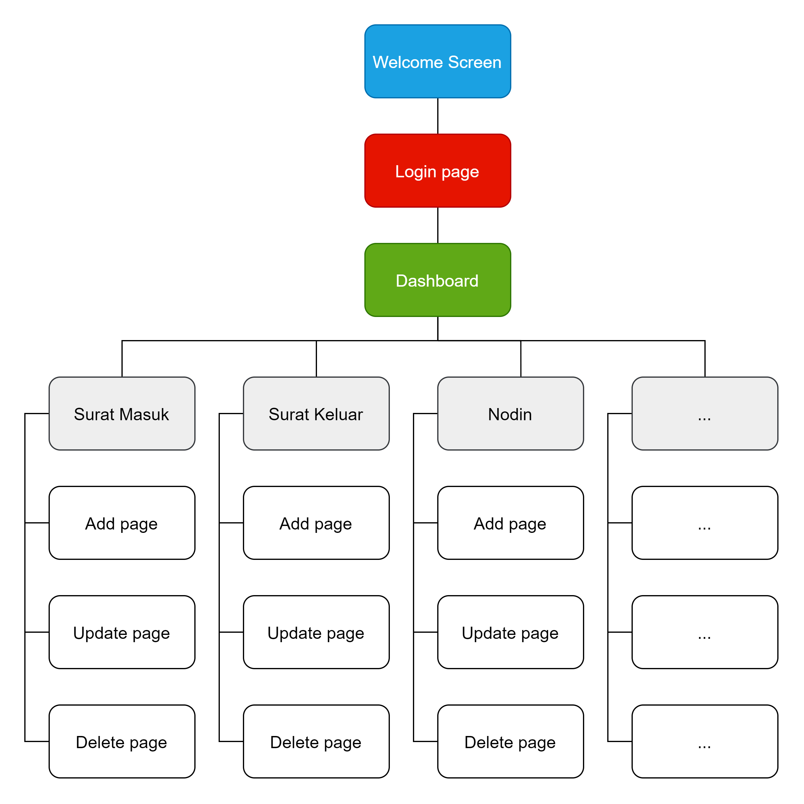

## 
 Disposisi

 

#### Description
An android application for managing letters and a REST API to integrate the app with MySQL database on the website server. This project is created for my volunteer work in BNNK Bandung, as per their request to create a mobile version of an existing web, so they can upload a letter without using computer.

#### Features
* Ability to upload, update, and delete a letter from a smartphone
* Application is integrated with website database using REST API
* Accept letter file in png, jpg, pdf, or docx
* Ability to upload image taken using camera directly
* Application display letters in list sort by incoming date
* Log in to access the database with an account created from the website

#### Technologies
* Java
* Android studio
* Retrofit
* PHP
* MySQL

#### System Diagram

#### Information Architecture

#### Screenshoots

