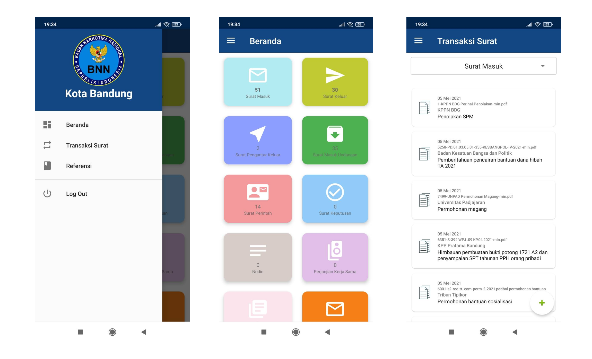
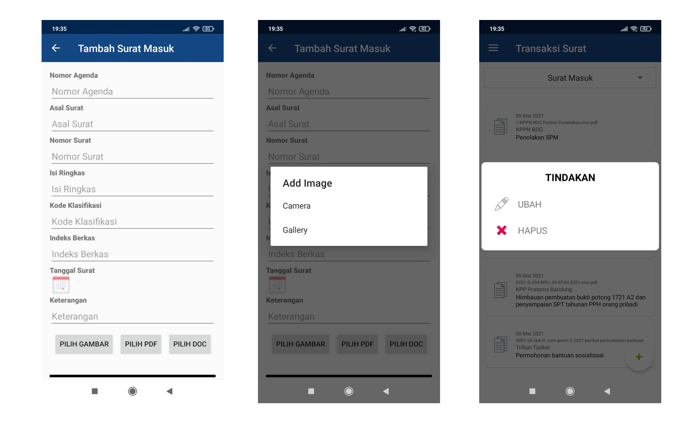

## 
 Disposisi

 

#### Description
Disposisi is an android application for managing letters that come in and go out from office. This is a project I created for my volunteer work in BNNK Bandung. I created this application as per their request to create a mobile version of an existing web that in developed then. So I created the web service too, to integrate with MySQL database. The application is created using java and android studio.

#### Features
* Save an important info of the new letter
* Save letter file as an image(png/jpg), pdf, or docx
* Display letter list
* Upload pdf, docx, or image file letter from smartphone storage
* Upload a new image taken by camera phone
* Update or delete an existing letter info or file

#### Technologies
* Java
* Android studio
* Retrofit
* PHP Native
* MySQL

#### Screenshoots

