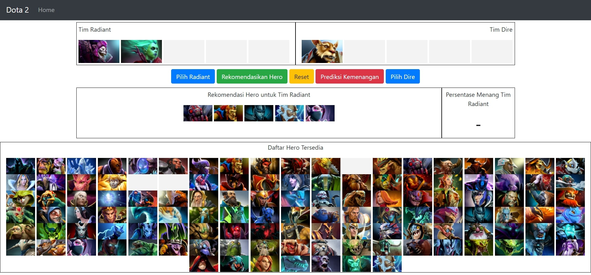

## 
 Dotamagus 

 

#### Description
This is a recommendation system for Dota 2 hero and match prediction webapp. It provides hero suggestions from the combination of heroes that often win when they are picked together. The recommendation system is built based on Association Rules using the FP-Growth algorithm. The recommendation algorithm is a custom made search algorithm with time complexity O(n³) (because I just focus on how to make it work, but will need to optimize it later on). For match prediction I originaly used neural nerwork algorithm Multilayer Percetron using tensorflow. But because installing tensorflow need 500MB or more storage space, I used logistic regression instead for the sake of deployment. The model and the web app is built with python and django.

#### Features
* Recommend heroes after picking at least one hero
* Prediction win percentage of radiant team (heroes picked based on recommendation system)

#### Technologies
* Python
* Django
* HTML
* CSS
* JS
* Bootstrap
* Mlxtend
* Pandas
* Scikit-Learn
* Tensorflow

#### Screenshoots
***

***

***

***

***

