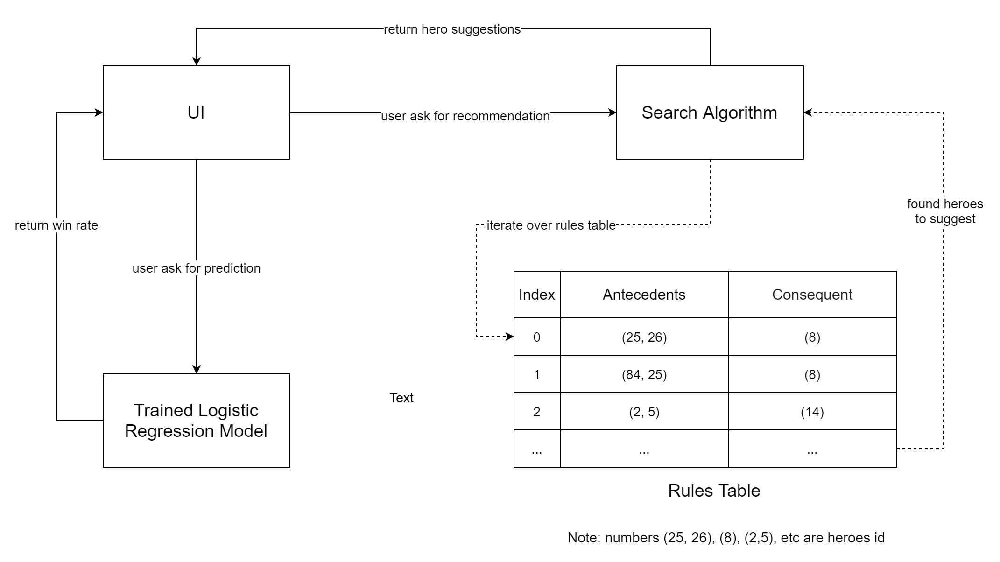
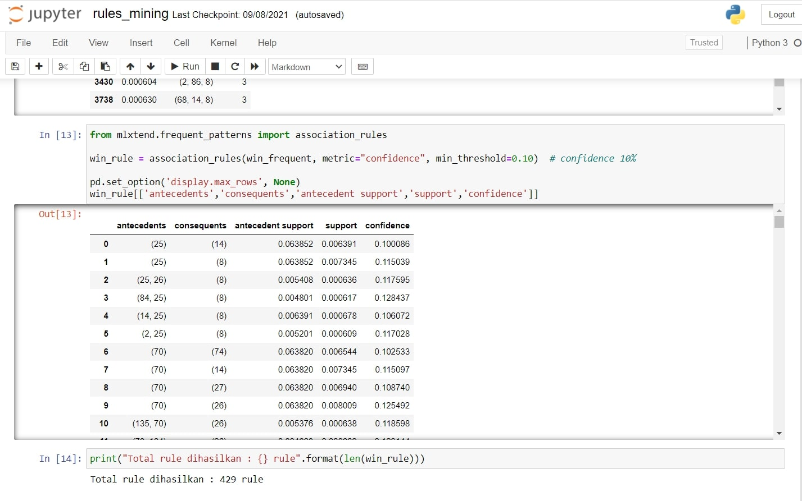

## 
 Dotamagus 

 

#### Description
Web-based Dota 2 hero recommendation system and match prediction. The system provides hero suggestions from the combination of heroes that often win when they are picked together. The recommendation system is built based on Association Rules which mined from a dataset of 621,064 Dota 2 matches using the FP-Growth algorithm. I developed 3 machine learning models Multilayer Perceptron, Logistic Regressing, and XGBoost with a similar accuracy of 63%. For deployment, Logistic Regressing is used which has the lowest storage need for dependencies installation. The results of the recommendation system performance obtained a success rate of 81% from 1000 simulations.

#### Features
* Data collector program used can collect 500 new Dota 2 match data every hour from opendota.com API
* Association rules obtained include 119 heroes from total of 121
* Ability to recommend heroes based on at least one hero picked
* Ability to predict the win rate of a team of heroes picked using a recommendation system against the other team
* Give an alert message for a recommendation or match prediction error
* The recommendation system performance obtained a success rate of 81% in 1000 simulations.

#### Technologies
* Python
* Django
* HTML
* CSS
* JS
* Bootstrap
* Mlxtend
* Pandas
* Scikit-Learn
* Tensorflow
* Conda

#### System Diagram
***

#### Screenshoots
***

***

***

***

***

#### Paper
Read more detail of this project on this <a href="https://github.com/erwintobing15/dotamagus/raw/assets/paper.pdf" download>paper</a>.
