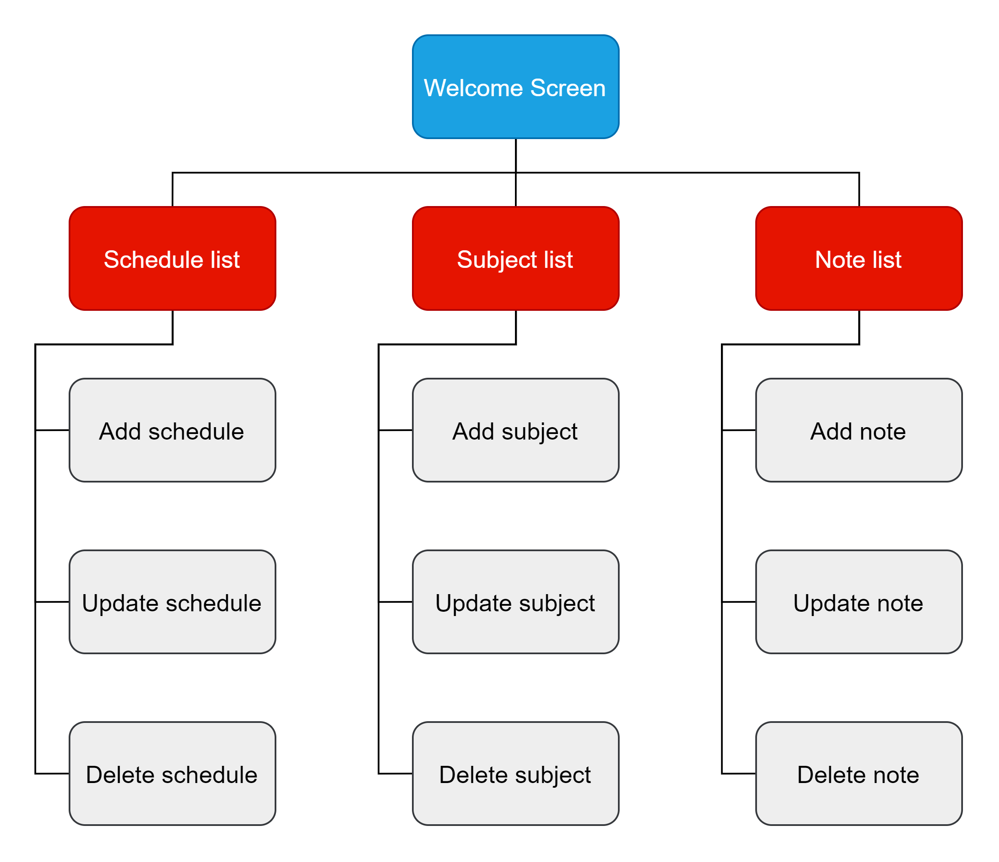

## 
 iKuliah 

 

#### Description
A simple android app to save university course credits, grades and calculate GPA. This is the first android app that I built to complete one of my university assignments.

#### Features
* Ability to add, update, and delete credit and grade of as subject
* Calculate GPA from totals credit save
* Ability to add, update, and delete simple note
* Ability to add, update, and delete simple schedule

#### Technologies
* Java
* Android Studio
* SQLite

#### Information

#### Screenshoots

