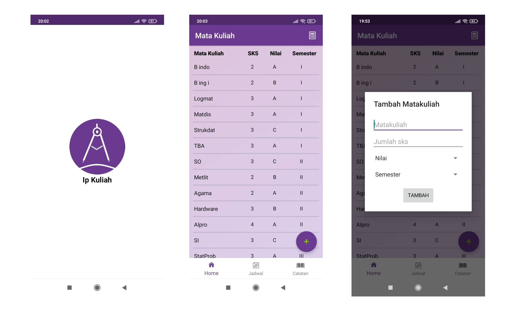

## 
 iKuliah 

 

#### Description
iKuliah is a simple android app to save university course credits, grades and calculate GPA. This is the first android app that I built to complete one of my university assignments. This app is built using java and android studio.

#### Features
* Save a course credit and grade
* Calculate GPA

#### Technologies
* Java
* Android Studio
* SQLite

#### Screenshoots

